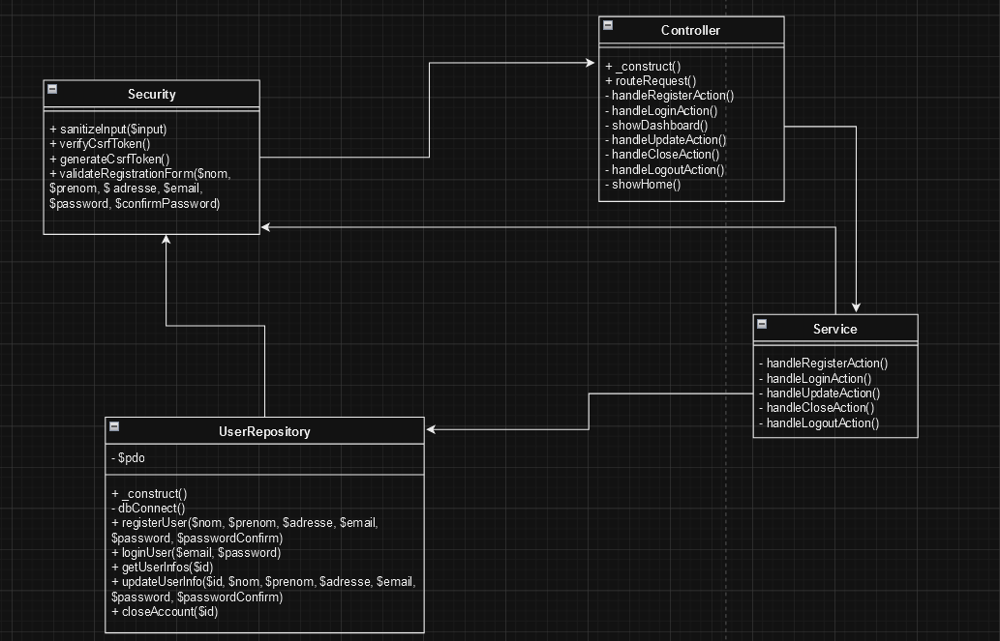

### TP7
Le but de ce tp est de créer un portefolio ou nous pouvons nous connecter avec de la POO.
Nous avons pu utilisé un TP, précédemment fait, comme base de départ

## Introduction 
# Objectif du site web : 
Ce site web est conçu pour permettre à un utilisateur de présenter son portefolio. Pour y accéder il faut bien sur se connecter en s’étant préalablement enregistrer sur le site.
# Contexte et portée du projet : 
Pour présenter ses projets facilement, il faut créer un portefolio. Nous permettons donc à la personne de faire un portefolio en ligne et de voir toutes les personnes regardant son portefolio.
# Public cible : 
Le public ciblé de notre portefolio est les différents étudiants qui n’ont pas encore de portefolio et bien sûr les entreprises qui le regarderont.

## Description Générale :
# Présentation du site web : 
Le site web comportera plusieurs pages. Une de présentation des différents projets. La page de connexion (la première page quand nous nous connectons) et la page d’enregistrement (si la personne n’a pas encore de compte crée).
# Fonctionnalités clés : 
Les utilisateurs peuvent s’enregistrer sur le site. Et se connecter plus tard grâce à une base de données. 
# Technologies utilisées : 
Nous avons utilisés de l’HTML et du CSS pour le design. Pour la partie fonctionnalité, nous avons utilisé du PHP avec un accès a une base de données SQL
# Contraintes de conception : 
Il faut apprendre comment connecter une base de données avec PHP sur le tas

## Structure du site 
# Architecture du site : 
La première page affichée sera la page de connexion, de la nous pouvons aller sur les pages « s’enregistrer » ou se connecter et voir les events 
# Organisation des contenus : 
La navigation entre les différentes pages se fera avec les différents boutons (Ex : Se connecter, S’enregistrer, Se déconnecter)
# Diagramme de classe 

## Design et Interface Utilisateur :
# Conception visuelle : 
Le site adoptera une palette de couleurs chaudes mais sobres, associée à une typographie grasse mais lisible pour un confort visuel dans le noir.
# Adaptabilité et accessibilité : 
Le design sera responsif, assurant une adaptabilité sur différents appareils.

## Fonctionnalités :
# Formulaire de contact : 
Recueil du pseudo (l’id) de l’utilisateur, les autres données étant dans la base données, il suffit juste de les récupérer
# Gestion des utilisateurs : 
Il faut s’enregistrer d’abord, dès qu’on est enregistrer, nous pouvons nous connecter. Pour s’enregistrer il faut un id (pseudo) unique, un nom, un prénom, une adresse, une adresse email et un mot de passe
	
## Sécurité :
# Protection des données : 
Les données sont mises dans une base SQL, sécurisée contre les injections SQL
# Protection attaques xss : 
Notre site web est protégé contre les attaques xss

## Gestion du projet :
# Répartition des taches : 
Paul s’occupe de tout
# Planning et méthodologie : 
Le cahier des charges, et les différents diagrammes seront finis pour le lundi 4 mars. La connexion à la base de données pour le 5 mars. La partie portefolio sera finie pour le mercredi 6 mars
# Outils de collaboration : 
Nous utilisons GitHub pour collaborer

## Budget et ressources :
# Évaluation des coûts : 
Nous avons évaluer à 5310€ le cout de développement de ce site web
# Besoins en ressources : 
Nous avons besoin d’un accès constant à une base de données pour faire fonctionner ce site web

## Charte Graphique :
# Couleurs : 
#f3b248 ; #ffebcd ; #000000
 
# Typo :  
Fredoka_Condensed-Medium.ttf
